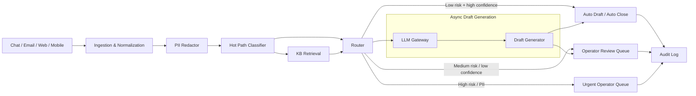

# Architecture

## Общая схема

## Описание контуров

### Hot path

Hot path должен быть быстрым и дешёвым:

1. PII detection / redaction.
2. Классификация темы.
3. Оценка риска.
4. Retrieval из базы знаний.
5. Маршрутизация.

Целевой SLA hot path — до 500 мс на тикет.

В PoC hot path реализован правилами и локальным retrieval. В production здесь должна быть быстрая ML-модель или ансамбль правил + лёгкая модель.

### Async path

Генерация ответа может быть асинхронной:

1. LLM получает только безопасный контекст.
2. Для high-risk и PII LLM не используется или используется только после дополнительного контроля.
3. Если LLM недоступен, система использует шаблон или отправляет тикет оператору.
4. Все решения логируются.

### Почему LLM не находится на hot path

LLM дает:

- высокую задержку;
- нестабильность;
- стоимость;
- риски безопасности.

Поэтому LLM не должен принимать решение о маршрутизации и не должен быть обязательным для первого ответа.
